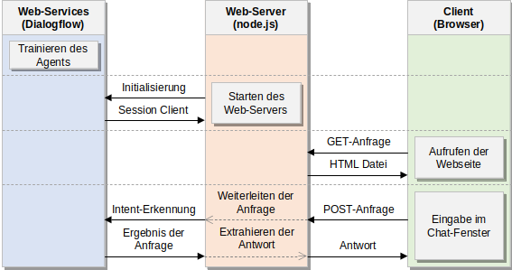
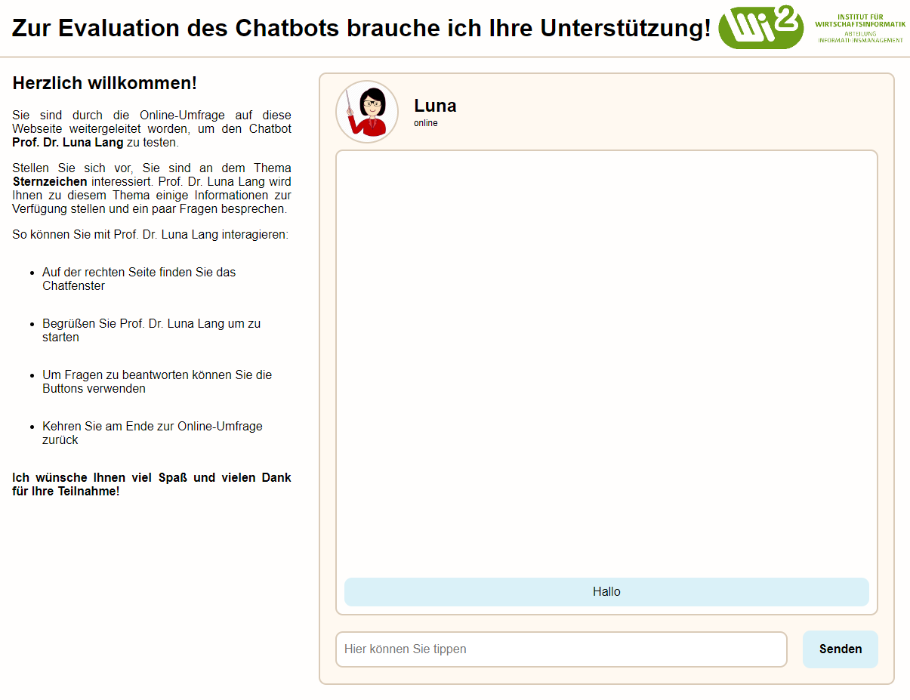

# MasterThesis

Dies ist das Repository für die Masterarbeit von Xingyang Zhu mit dem dem Titel 'Prototypische Programmierung kulturell-orientierter Learning-Companions mit anschließender Studie über die Wahrnehmung in unterschiedlichen Kulturen'.

| Datei/Ordner | Beschreibung |
|:----------|:--------|
| [server.js](https://github.com/XingyangZhu/MasterThesis/blob/main/server.js) | Web-Server in node.js zur Implementierung der Kommunikation zwischen dem Client (Browser) und dem Web-Service (Dialogflow). |
| [public](https://github.com/XingyangZhu/MasterThesis/tree/main/public) | Scripts, CSS und HTML Dateien, die beim Aufrufen der Webseite an den Client gesendet werden sollen. |
| [chatbot-1](https://github.com/XingyangZhu/MasterThesis/tree/main/chatbot-1) | Implementierung der Kommunikation mit dem Learning-Companion mit niedriger Machtdistanz. |
| [chatbot-2](https://github.com/XingyangZhu/MasterThesis/tree/main/chatbot-2) | Implementierung der Kommunikation mit dem Learning-Companion mit hoher Machtdistanz. |
| [docu](https://github.com/XingyangZhu/MasterThesis/tree/main/docu) | Bilder zur Dokumentation. |

## Übersicht

<div align="center">
    
    </img>
</div>

## Konfiguration

1. Für jeden Learning-Companion in Google Cloude Services einen Service Account erstellen.
2. Service Account exportieren.
3. **googleProjectId**, **googlePrivateKey** und **googleClientEmail** in devkey.js für beide Learning-Companions eintragen, um die Kommunikation mit Dialogflow über den Web-Server zu erlauben.

## Starten

### Horuko App

1. Durch die Datei Procfile wird der Web-Server beim Upload auf Horuko automatisch gestartet.
2. Anschließend können die Webseiten im Browser aufgerufen werden, um mit den beiden Learning-Companions in Dialogflow zu kommunizieren.
```bash
# Learning-Companion mit niedriger Machtdistanz.
https://dialogflow-master-thesis.herokuapp.com/chatbot-1
# Learning-Companion mit hoher Machtdistanz.
https://dialogflow-master-thesis.herokuapp.com/chatbot-2
```

### Lokal

1. Der Web-Server kann lokal auf dem eigenen Pc gestartet werden.
2. Anschließend können die Webseiten im Browser aufgerufen werden, um mit den beiden Learning-Companions in Dialogflow zu kommunizieren.

```bash
# Web-Server starten.
npm test
```
```bash
# Learning-Companion mit niedriger Machtdistanz.
http://localhost:5000/chatbot-1
# Learning-Companion mit hoher Machtdistanz.
http://localhost:5000/chatbot-2
```

<div align="center">
    
    </img>
</div>