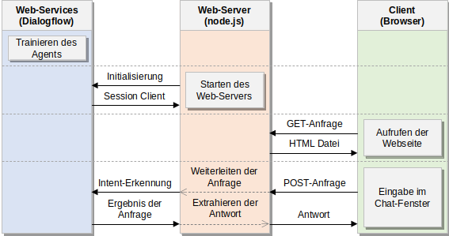
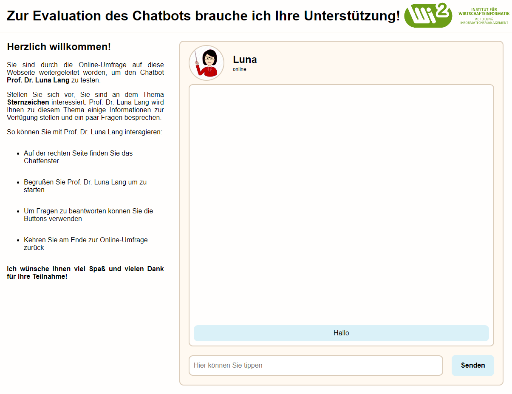

# MasterThesis

Dies ist das Repository für die Masterarbeit von Xingyang Zhu mit dem dem Titel 'Prototypische Programmierung kulturell-orientierter Learning-Companions mit anschließender Studie über die Wahrnehmung in unterschiedlichen Kulturen'.

| Inhalt    | Beschreibung |
|:----------|:--------|
| server.js | Main node.js server Datei. |
| public    | Scripts, CSS und HTML Dateien, die beim Aufrufen der Webseite an den Client gesendet werden sollen. |
| chatbot-1 | Implementierung der Kommunikation mit dem Learning-Companion mit niedriger Machtdistanz. |
| chatbot-2 | Implementierung der Kommunikation mit dem Learning-Companion mit hoher Machtdistanz. |

## Übersicht

<div align="center">
    
    </img>
</div>

## Starten

### Horuko App

1. Durch die Datei Procfile wird der Web-Server beim Upload auf Horuko automatisch gestartet.

2. Anschließend können die Webseiten im Browser aufgerufen werden, um mit den beiden Learning-Companions in Dialogflow zu kommunizieren.

```bash
# Learning-Companion mit niedriger Machtdistanz.
https://dialogflow-master-thesis.herokuapp.com/chatbot-1
# Learning-Companion mit hoher Machtdistanz.
https://dialogflow-master-thesis.herokuapp.com/chatbot-2
```

### Lokal

1. Der Web-Server kann lokal auf dem eigenen Pc gestartet werden.

```bash
# Web-Server starten.
npm test
```

2. Anschließend können die Webseiten im Browser aufgerufen werden, um mit den beiden Learning-Companions in Dialogflow zu kommunizieren.

```bash
# Learning-Companion mit niedriger Machtdistanz.
http://localhost:5000/chatbot-1
# Learning-Companion mit hoher Machtdistanz.
http://localhost:5000/chatbot-2
```

<div align="center">
    
    </img>
</div>